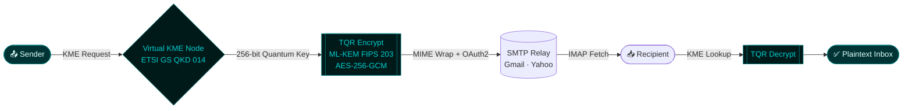

<div align="center">

<!-- ═══════════════════════════════════════════════════════════════ -->
<!--                     ANIMATED HEADER BANNER                      -->
<!-- ═══════════════════════════════════════════════════════════════ -->


<!-- TYPING SVG -->
<a href="https://git.io/typing-svg">
  
</a>

<br/>

<!-- PROFILE VIEWS + FOLLOWERS + LAST UPDATED -->

&nbsp;

&nbsp;

&nbsp;


</div>

---

<!-- ═══════════════════════════════════════════════════════════════ -->
<!--                      OPERATIONAL OVERVIEW                        -->
<!-- ═══════════════════════════════════════════════════════════════ -->

## `> whoami`

```yaml
operator: Mohammed Uzair Shaikh
role: AI Security Engineer · Threat Intelligence Analyst · PQC Researcher
location: Mumbai, India
clearance: UNCLASSIFIED // TLP:CLEAR
education: B.Sc. (Hons.) AIML — University of Mumbai [2025–2029]
           Diploma in AIML Engineering               [2022–2025]

focus_areas:
  - Post-Quantum Cryptography (ML-KEM / FIPS 203)
  - Cyber Threat Intelligence & OSINT
  - Adversarial AI & LLM Security
  - Zero-Trust Infrastructure Design
  - PhaaS / eCrime Ecosystem Forensics

motto: "The quantum future isn't coming — it's already being harvested."
```

<div align="center">

<a href="https://linkedin.com/in/mohammed-uzair-shaikh">
  
</a>
&nbsp;
<a href="mailto:uzair.shaikh.sec@gmail.com">
  
</a>
&nbsp;
<a href="https://github.com/uzx-02">
  
</a>

</div>

---

<!-- ═══════════════════════════════════════════════════════════════ -->
<!--                      RECOGNITION                                  -->
<!-- ═══════════════════════════════════════════════════════════════ -->

## 🏆 Recognition

<div align="center">

|            Medal            | Project                              | Issued By                       |   Year   |
| :-------------------------: | ------------------------------------ | ------------------------------- | :------: |
|    🥉 **2nd Runner Up**     | QuMail — Quantum-Secure Email Client | HackToon 1.0, AIKTC             | Mar 2026 |
| 🎖️ **Top 8 / 1,000+ Teams** | Quantum-AI Hybrid Defense System     | Aavishkar, University of Mumbai | Dec 2025 |

> _The Aavishkar project was independently rated at **Graduate / PhD level** for research maturity and novel hardware-seeded quantum integration — competing across all Engineering & Technology teams of Mumbai University._

</div>

---

<!-- ═══════════════════════════════════════════════════════════════ -->
<!--                     FEATURED ENGINEERING                          -->
<!-- ═══════════════════════════════════════════════════════════════ -->

## ⚡ Featured Engineering

<!-- ─── PROJECT 1: QuMail ─── -->
<details open>
<summary><b>📧 QuMail — Quantum-Secure Email Client</b> &nbsp;|&nbsp; <code>Public</code> &nbsp;<a href="https://github.com/uzx-02/QuMail">→ View Repo</a></summary>

<br/>

> _Open-source PQC implementation for civilian communications, aligned with **ISRO Problem Statement PS 25179** and India's CII PQC deadline of Dec 31, 2028._

**QuMail adds a transparent post-quantum encryption layer to Gmail & Yahoo — zero changes required from recipients.**

**Architecture Flow:**



| Layer                    | Technology              | Standard        |
| ------------------------ | ----------------------- | --------------- |
| **Tier 1 — Quantum OTP** | Quantum One-Time Pad    | Custom          |
| **Tier 2 — Symmetric**   | QKD-seeded AES-256-GCM  | NIST            |
| **Tier 3 — PQC KEM**     | ML-KEM (Kyber)          | FIPS 203        |
| **Key Infrastructure**   | Virtual KME + Cloud Run | ETSI GS QKD 014 |

🏆 **2nd Runner Up — HackToon 1.0, AIKTC**

</details>

---

<!-- ─── PROJECT 2: Advanced Encryption Tool ─── -->
<details>
<summary><b>🔐 Advanced Encryption Tool (AET)</b> &nbsp;|&nbsp; <code>Public</code> &nbsp;<a href="https://github.com/uzx-02/advanced-encryption-tool">→ View Repo</a></summary>

<br/>

> _A production-grade, cross-platform desktop file encryption utility built on strict zero-trust architecture._

**AET is a zero-trust file vault — every operation is cryptographically isolated, no plaintext persists.**

```
┌─────────────────────────────────────────────────────┐
│              ZERO-TRUST FILE ENCRYPTION             │
├──────────────────┬──────────────────────────────────┤
│  Key Derivation  │  Argon2id (memory-hard KDF)      │
│  Encryption      │  AES-256-GCM (authenticated)     │
│  Architecture    │  Strict separation per operation │
│  Platform        │  Cross-platform desktop utility  │
│  Threat Model    │  Hostile environment, no trust   │
└──────────────────┴──────────────────────────────────┘
```

</details>

---

<!-- ─── PROJECT 3: CTI Reports ─── -->
<details>
<summary><b>🕵️ Cyber Threat Intelligence — OSINT Reports</b> &nbsp;|&nbsp; <code>Public</code> &nbsp;<a href="https://github.com/uzx-02/threat-intelligence">→ View Repo</a></summary>

<br/>

> _Independent CTI research tracking PhaaS ecosystems, AiTM campaigns, and live threat infrastructure. All reports mapped to **MITRE ATT&CK v19**, exported with **STIX 2.1** compatible IOCs._

**Featured Investigation: `CTI-2026-IG-001` — WIXXI TOOLS**

```
┌─────────────────────────────────────────────────────────────────┐
│  INVESTIGATION: WIXXI TOOLS — PhaaS Ecosystem Forensics         │
│  Classification: TLP:CLEAR  |  Confidence: HIGH                 │
├─────────────────────────────────────────────────────────────────┤
│  INFRASTRUCTURE                                                 │
│  ├─ 68-domain Anycast Cluster — mapped and documented           │
│  ├─ Live Telegram C2 workflow — extracted and analyzed          │
│  └─ Programmatic AI-scraper evasion (no-ai, no-scraping tags)   │
│                                                                 │
│  TTPs (MITRE ATT&CK v19)                                        │
│  ├─ AiTM session cookie interception → MFA bypass               │
│  ├─ Adversary-in-the-Middle phishing proxy infrastructure       │
│  └─ Telegram-based C2 exfiltration channels                     │
│                                                                 │
│  IOC — STIX 2.1 (ACTIVE REFERENCE)                              │
│  [file:hashes.SHA256 =                                          │
│  '5f5ee6cccae791f9cc3d34020422c5cb49dd9f20522e53e71955ce472...']│
│  Valid-from: 2025-07-01  |  Status: ACTIVE REFERENCE            │
└─────────────────────────────────────────────────────────────────┘
```

</details>

---

<!-- ─── PROJECT 4: Quantum-AI Hybrid Defense System ─── -->
<details>
<summary><b>🧠 Quantum-AI Hybrid Defense System</b> &nbsp;|&nbsp; <code>Restricted — Research</code></summary>

<br/>

> _A research-grade, four-layer cybersecurity architecture defeating both classical and post-quantum threats. Hardware entropy → BB84 QKD → Neuro-Symbolic AI → Quantum-signed transactions._

```
LAYER ARCHITECTURE
══════════════════════════════════════════════════════════

  [ Layer 1 ]  Hardware Root of Trust
               ESP32 Zener diode avalanche noise TRNG
               Von Neumann debiasing + CSPRNG hot-failover

       ↓
  [ Layer 2 ]  BB84 QKD Simulation
               Physics-accurate protocol implementation
               QBER eavesdrop detection
               Decoy State Protocol (PNS attack mitigation)

       ↓
  [ Layer 3 ]  Neuro-Symbolic AI Anomaly Engine
               Isolation Forest anomaly detection
               Symbolic rule engine: XSS · SQLi · Impossible Travel

       ↓
  [ Layer 4 ]  Quantum-Signed Transactions
               HMAC-SHA256 from quantum-derived keys
               Quantum Bank PoC — MITB attack blocked & logged

══════════════════════════════════════════════════════════
```

> \*Repository access restricted to protect ongoing research. Full documentation and code audit available for **academic or professional review upon request.\***

🎖️ **Top 8 / 1,000+ Engineering Teams — Aavishkar, University of Mumbai · Dec 2025**
📜 **Rated at Graduate / PhD level** by independent academic reviewers.

</details>

---

<!-- ═══════════════════════════════════════════════════════════════ -->
<!--                     TECH ARSENAL                                  -->
<!-- ═══════════════════════════════════════════════════════════════ -->

## ⚔️ Technical Arsenal

<div align="center">

<!-- Skill Icons: https://skillicons.dev -->

**Languages & Core**

[](https://skillicons.dev)

**AI / ML Stack**

[](https://skillicons.dev)

</div>

<br/>

<div align="center">

| Domain                | Competencies                                                         | Frameworks & Tools                       |
| --------------------- | -------------------------------------------------------------------- | ---------------------------------------- |
| 🛡️ **Cybersecurity**  | SOC Analysis · Threat Hunting · CTI · VAPT · DFIR · Malware Analysis | SIEM · OpenCTI · MISP · MITRE ATT&CK v19 |
| 🔐 **Cryptography**   | Post-Quantum (ML-KEM) · QKD · AES-GCM · Argon2id · TRNG              | `cryptography` · `liboqs` · FIPS 203     |
| 🕵️ **Threat Intel**   | OSINT · PhaaS Forensics · AiTM Analysis · STIX 2.1 · IOC Mapping     | MISP · OpenCTI · Maltego · Shodan        |
| 🧠 **AI / ML**        | Applied ML · LLM Security · Adversarial AI · Neuro-Symbolic          | Python · Scikit-Learn · Isolation Forest |
| ⚙️ **Infrastructure** | Zero-Trust Architecture · SSR · CI/CD                                | Linux · Docker · GCP · Git · Rust        |

</div>

<br/>

<div align="center">

<!-- Shields badges for cybersecurity-specific tools without skill icon equivalents -->


</div>

---

<!-- ═══════════════════════════════════════════════════════════════ -->
<!--                     GITHUB STATS                                  -->
<!-- ═══════════════════════════════════════════════════════════════ -->

## 📊 GitHub Stats

<div align="center">


&nbsp;


<br/><br/>


</div>

---

<!-- ═══════════════════════════════════════════════════════════════ -->
<!--                     TROPHIES                                      -->
<!-- ═══════════════════════════════════════════════════════════════ -->

## 🏅 GitHub Trophies

<div align="center">


</div>

---

<!-- ═══════════════════════════════════════════════════════════════ -->
<!--                     CONTRIBUTION SNAKE                            -->
<!-- ═══════════════════════════════════════════════════════════════ -->

## 🐍 Contribution Graph

<div align="center">

<picture>
  <source media="(prefers-color-scheme: dark)" srcset="https://raw.githubusercontent.com/uzx-02/uzx-02/output/github-contribution-grid-snake-dark.svg" />
  <source media="(prefers-color-scheme: light)" srcset="https://raw.githubusercontent.com/uzx-02/uzx-02/output/github-contribution-grid-snake.svg" />
  
</picture>

</div>

<!-- ═══════════════════════════════════════════════════════════════ -->
<!--                     CURRENTLY EXPLORING                           -->
<!-- ═══════════════════════════════════════════════════════════════ -->

## 🔭 Current Intel Feed

```
[ ACTIVE RESEARCH THREADS ]

  ░░░░░░░░░░░░░░░░░░░░░░░░░░░░░░░░░░░░░░░░░░░░░░░░░░

  ⬡  Post-Quantum × Classical Hybrid Migration Paths
     Gaps, breakthroughs, and what survives RSA's end

  ⬡  Adversarial AI & LLM Security
     Prompt injection, model inversion, red-teaming LLMs

  ⬡  SOC Detection Engineering
     Hands-on threat hunting and custom SIEM rule development

  ⬡  Autonomous Security Tooling (AI Agents)
     Building agentic workflows for threat response automation

  ⬡  Open Source Contributions
     Building in public — starting now

  ░░░░░░░░░░░░░░░░░░░░░░░░░░░░░░░░░░░░░░░░░░░░░░░░░░
```

---

<!-- ═══════════════════════════════════════════════════════════════ -->
<!--                     OPEN TO COLLABORATE                           -->
<!-- ═══════════════════════════════════════════════════════════════ -->

## 🤝 Open to Collaborate On

<div align="center">

| Area                              | What I Bring                                                              |
| --------------------------------- | ------------------------------------------------------------------------- |
| 🔐 **Post-Quantum Cryptography**  | PQC library integration, ML-KEM, QKD simulation, FIPS 203 implementations |
| 🕵️ **CTI & Threat Hunting**       | OSINT, STIX IOC production, MITRE ATT&CK mapping, PhaaS forensics         |
| 🧠 **AI/ML Security**             | Adversarial ML, LLM red-teaming, prompt injection, neuro-symbolic AI      |
| 🛡️ **Detection Engineering**      | SIEM rules, anomaly detection, SOC automation, IR playbooks               |
| ⚙️ **Open-Source Security Tools** | Linux security automation, CTI tooling, zero-trust architectures          |

</div>

---

<!-- ═══════════════════════════════════════════════════════════════ -->
<!--                       OPERATOR NOTE                              -->
<!-- ═══════════════════════════════════════════════════════════════ -->

## ⚡ Operator Note

> _When I'm not hunting threats or building quantum defenses, I'm gaming — and yes, I play to win._
> _The obsessive pattern recognition that makes a good CTF player makes a good gamer. Turns out they're the same skill._

---

<!-- ═══════════════════════════════════════════════════════════════ -->
<!--                         FOOTER                                    -->
<!-- ═══════════════════════════════════════════════════════════════ -->

<div align="center">


_`// EOF — All research conducted legally and ethically. All IOCs are public reference only.`_
